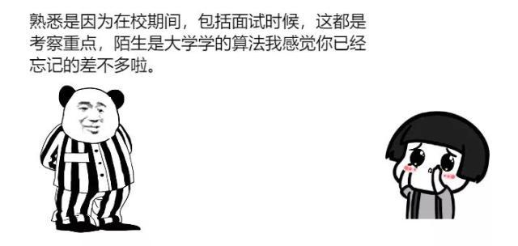
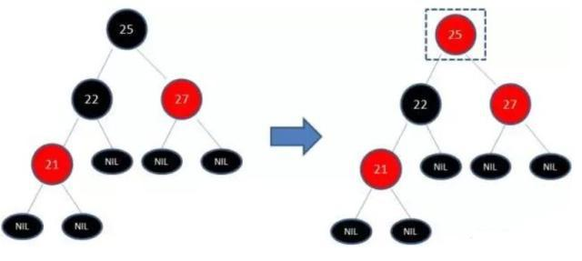

# 漫画：什么是红黑树

[百度首页](https://www.baidu.com/)

[wiseheadchen](http://i.baidu.com/)

## 漫画：什么是红黑树

脚本之家

发布时间：19-08-1609:27

下面为标准的二叉排序树

初始状态

其实想要搜索值为226的节点很简单，搜索动画过程如下：

这样不行！

这是个病！

得治！

红黑树就是一种平衡的二叉查找树，说他平衡的意思是他不会变成“瘸子”，左腿特别长或者右腿特别长。除了符合二叉查找树的特性之外，还具体下列的特性：

1\. 节点是红色或者黑色

2\. 根节点是黑色

3\. 每个叶子的节点都是黑色的空节点（NULL）

4\. 每个红色节点的两个子节点都是黑色的。

5\. 从任意节点到其每个叶子的所有路径都包含相同的黑色节点。

下面为标准的红黑树，阿广建议大家对照下面的图理解上边写的红黑树的性质哦~

（黑色的NULL节点可忽略）

例如上面标准的红黑树，插入值为12的节点。

插入之后发现仍然满足红黑树的要求！

但是如果插入值为21的节点呢？

如下图所示：

先来看一下变色！

为了符合红黑树的规则，会把节点红变黑或者黑变红。下图展示的是红黑树的部分，需要注意节点25并非根节点。因为21和22链接出现红色，不符合规则4，所以把22红变黑：

但这样还是不符合规则5，所以需要把25黑变红，看下图：

接下来先讲一下什么是左旋转！通过动画举个例子吧！

左旋转思想示意图如下

通俗点讲一下，可以看下面的左旋转静态示意图

按照左旋转，对上边已经变色完成之后图进行左旋转。

可见右旋转的思想总结如下：

通俗点讲一下，可以看下面的右旋转静态示意图

接下来，对上边经过左旋转之后的图进行右旋转。

人生像红黑树一样，总是需要某种平衡

一边是给予，一边是接受

一边是付出，一边是得到

一边是耕耘，一边是收获

一边是物质，一边是精神

阿广你年过二十而未立

置身于五光十色的世俗社会

我希望阿广都能铭记

一个古老但不失色彩的道理！

“活得简单才能活得自由”

因为舍得，所以淡泊

因为朴素，难以物役

所以保持精神和内在的富有

才是平衡的前提

## 相关文章

*   ### [“TZ301-1”钻井平台天津起运远赴墨西哥湾](https://mbd.baidu.com/newspage/data/landingsuper?context=%7B%22nid%22%3A%22news_9053268615763380627%22%7D&n_type=1&p_from=4)
    
    
    
*   ### [中国成全球最大的服装生产和出口国2020年中国服装行业出口现状分析（图）](https://mbd.baidu.com/newspage/data/landingsuper?context=%7B%22nid%22%3A%22news_9212479162185349618%22%7D&n_type=1&p_from=4)
    
    
    
*   ### [中国石化西南局天然气创新高 年产已超20亿方](https://mbd.baidu.com/newspage/data/landingsuper?context=%7B%22nid%22%3A%22news_9724361486360041648%22%7D&n_type=1&p_from=4)
    
    
    
*   ### [创业板注册制来了！首批企业何时亮相？一文速览改革重点、A股影响及受益板块](https://mbd.baidu.com/newspage/data/landingsuper?context=%7B%22nid%22%3A%22news_9855245641156551824%22%7D&n_type=1&p_from=4)
    
    
    
*   ### [疫情防控不放松 浙江扫黑除恶再加速](https://mbd.baidu.com/newspage/data/landingsuper?context=%7B%22nid%22%3A%22news_8559393534614727855%22%7D&n_type=1&p_from=4)
    
    
    

[设为首页](https://www.baidu.com/cache/sethelp/index.html)© Baidu [使用百度前必读](https://www.baidu.com/duty/) [意见反馈](http://jianyi.baidu.com/) 京ICP证030173号 

[京公网安备11000002000001号](http://www.beian.gov.cn/portal/registerSystemInfo?recordcode=11000002000001)

---------------------------------------------------

原网址: [访问](https://baijiahao.baidu.com/s?id=1641940303518144126&wfr=spider&for=pc)

创建于: 2020-04-28 09:46:00

目录: 算法

标签: `树`, `baijiahao.baidu.com`

